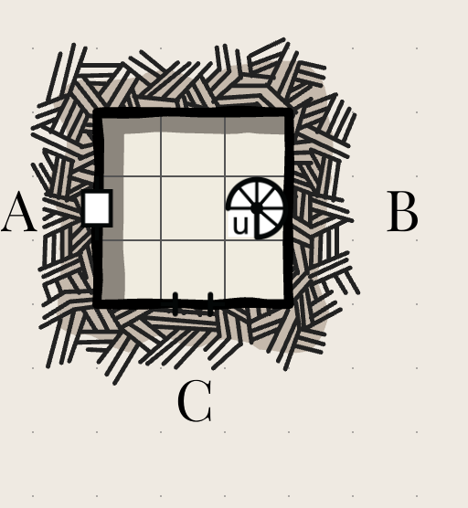

# First floor
All rooms here are completely dark. The air is cool, like a cellar.  

*Content note* Beyond this point, there are large insects, snakes and spiders.

## The kitchen

Stairs (B) here go down to the cellar (the southeast corner, connecting to the East and South tunnels.)

A chimney goes upwards (C), and water drips down.  There is a pile of relatively fresh bones at the bottom of the chimney.

A door leads north (A), to what appears to be a large empty hall. You can hear buzzing from that direction.

A small hole in the wall, perhaps big enough to pass food through, is to the east (D), with a shelf on the other side of the hole. Through it if you shine a light you can see a 15' by 15' room with a door leaving it and a staircase up. Several large shelves have fallen over onto the ground. You can't fit through the hole but you could pass small objects through. You hear a voice on the other side, faint and as though carried on the wind, saying "Water... water..." but you see nobody and nobody replies to you. 

The kitchen has a table in the middle and against the west wall, with various pieces of pottery on it. Some are full of unidentifiable muck, others are clean, and many are broken into shards on the ground. If you have tried to cross without a torch, take 1d6 STR damage. 

### Going up the chimney

You need both hands to climb. There seems to be some webbing, which you will stick to if you try and climb it (need a DEX save to free yourself). If you touch the webbing, you attract the attention of the spider.

Nonexistent spider
4 HP, 10 STR, 12 DEX, 10 WIL, bite (d6)
- Damage that bypasses HP damages WIL instead.
- Critical damage: Until you can be treated by someone with a knowledge of antidotes and access to them, you can no longer perceive spiders of any kind.

You can continute up to the bedroom [TODO link]

## Great hall

The Great Hall has mostly collapsed in on itself, with the entire northwest corner being buried in dirt. There are still some intact tables lying around.

A giant land-bee nest is in the middle, having taken over the middle table, which is partly constructed of paper mache like layers of leaf matter. They are herbivores, but very territorial. They come in smaller numbers than larger bees: 2d6 workers and one queen at any given time.

Giant Land-Bee worker
2 HP, 4 STR, 14 DEX, 10 WIL, sting (d4)
- Each is about the size of a dog.
- Each can sting once in their life. They don't die after stinging, but they do telepathically signal to all other bees within 100' that they have stung someone and the location where it happened.
- Critical damage: you take 1d10 DEX damage.
- They can fly 40' at a time, but then have to land.

Inside is a land-bee queen.
2 HP, 10 STR, 6 DEX, 12 WIL, no weapons (d4)
- Can communicate telepathically if you touch her. 
- Twice the size of the other bees, and cannot easily move.

On the south wall, you have a door to the kitchen (A) [TODO link] by the southeast corner, another door [TODO link] halfway down (B), and then a wall. Another room is inset into the larger room. The door to this (C) is half-buried by dirt and would require a few minutes to open: enough time to use up one torch tick and for the TODO to attack.

The north wall, as mentioned, is mostly hidden by the large pile of dirt. You can see that much of the dirt came in through large arched windows set high in the wall, which are now thoroughly blocked by dirt. If the room is symmetrical, there might be another inset room in the hall (D), but it would take hours of digging to clear it. The northeast corner is uncovered, though, and there is a sort of closet with a chute leading back to the cellar (E). This is where you'd emerge if you climed from the cellar. From this northeast corner, you might be able to quickly get the door in the east wall (F) open before the bees attack, but it would take a DEX save to do so. The chute continues upwards, but the ceiling is higher. You'd need to climb on something to reach it. A table in the great hall could work, but it would be slow, loud and awkward.

There is a balcony one floor up overlooking the great hall (shown by the dotted line), and you can see two doors beyond it, but it's 30' up and overhanging the Great Hall by 5'. Without a method of climbing up, you would not be able to reach it, even from the dirt pile.

### Talking to the land-bee queen
This probably happens if you get completely paralyzed.
If you can convince them you are not a threat, they will let you go as long as you stay out of this room and the storage room. If you cannot convince them you are not a threat, you will fertilize the fungus in the storage room.
If you want their cooperation, you can get rid of a spider that has taken up residence in the chimney in the kitchen, limiting their ability to go out and feed their fungus farm.

## Storage Room
This large room, 15 feet by 30 feet, seemed to once store *someting* - grain maybe? But now is full of a thriving ecosystem of strange underground fungus. It's notably warmer than the others.

It's cultivated by the bees, and has 1d6 bees in it at any time.

There are two exits: back down the stairs, and into the Great Hall.

## Hidden room
You can uncover this room after digging for hours. It is 10 feet by 25 feet.

It contains TODO treasure.

It has a single exit, back to the main hall.

## Armory
This room is 10 feet by 25 feet, and seems to have once held a lot of armour. Some of it is still intact - the room having been sealed kept out the moisture. In particular, there are several suits of plate mail in good condition, some helmets and shields, and a longsword.

The emblem on the shield is of a deer trampling a wolf. It's not one you're familiar with, and would only be recognized by someone who has studied the history of the region.

It has a single exit, back to the main hall.

## Meeting Room
This 15 foot by 15 foot room has a rotting table and rotting tapestries: it's cold, damp and humid, with mold growing everywhere. 

If you don't have the ability to cover your mouth, take 1d4 STR damage if you linger in here more than a few seconds, and acquire a nasty, loud cough for the rest of the day.

To the west is a door to the main hall (A). An additional door leads deeper into the castle (B). It's swollen and stuck. A STR save could break it open in seconds, making a noticeable amount of noise, or it could be pried open, in enough 
time to breathe in the spores as well as expend an extra tick on the torch clock.

## The Vestibule
A narrow room, 15' by 5', with two opposite doors on the long sides. One door leads back to the meeting room (A), the other one leads to another room (B).

There are some tables that seem to have once displayed something, but all that remains is a dagger. The dagger is mostly rusted away, but the hilt is made of gold, silver and glass jewels. It would be worth 100 gp to an unsophisticated buyer, 200 gp to someone who appreciates its age, and if restored and attached to a new dagger (something that you could do as a blacksmith) you could pass yourself off as someone of wealth and power in many situations.

## The Study 

Another 15' by 15' room. Here the furniture is sturdier and more intact, and the chair could be moved to another room should you want to be able to reach something higher. The tapestries are actually legible, showing a deer trampling a wolf. One door (A) leads back to the vestibule, the other (B) leads to the next room.

There are empty shelves on the wall, and the floor is slick with rotting pages from what must once have been books. It looks like they have all fallen off their shelves onto the floor. If you try and cross the room without a light, make a DEX save or take 1d6 DEX damage.

However, a closed drawer in the desk contains a cracked and faded parchment with a geneology. If you could find the Hart family, this could be used to establish a legal claim to these lands, gaining the favour of whatever motivated descendant you are able to find, and the disfavour of anyone with a competing claim (such as the Marquess). You would need to transport it in some kind of waterproof case.

> This is left open-ended. TODO some instructions on generating a quest 

## Stairs up 

This is the room that was visible from the kitchen, with one door leaving it (A), a staircase up (B), and a small opening in the wall leading to the kitchen (c), and a shelf next to the hole leading to the kitchen.

A large shelf has fallen down. If you pry it out of the way, you can find a skeleton.

When you enter, you see a ghost asking for water. It gets increasingly agitated, and if you don't provide any it will attack. If you do, it disappears. It will not leave the room.

Ghost (from the Cairn Bestiary by Yochai Gal): 10 HP, 3 Armor, 14 WIL, draining touch (d6).
- Can possess victims that fail a WIL save. 
- Critical damage: drains the victim's life force (d6 extra STR damage).

