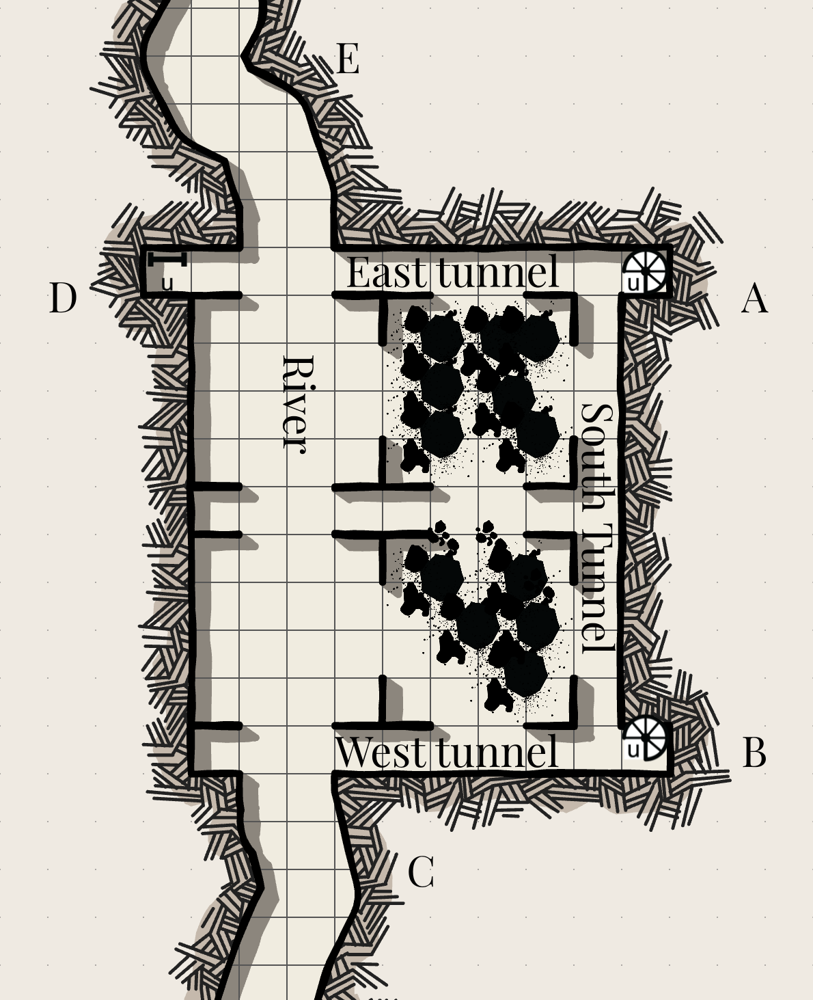

# The dungeon

Draw an 10 segment clock for your torch. Fill one segment whenver you:
- enter a new room (including hallways) unless otherwise stated
- spend time searching a room
- Fight another creature
- Spend several minutes doing any other significant activity

If you find yourself in the dark, roll on the oracle table to find out if you succeed at tasks such as searching a room, finding a desired exit, or identifying any dangers in the room. Trying to explore in the dark is dangerous and likely to go wrong.

> Note that once you leave, you can always come back and explore more when you're better equipped.

> Clocks are a terminology used more in Powered by the Apocalypse or Forged in the Dark games. One way to do them is to draw a circle and divide it into wedges and fill them in order like a clock. You could also do tick marks or bubbles. I like to use them to track resource consumption or growing danger in a convenient way. Usually when a clock is filled, something bad happens.

## Partially collapsed room

Dirt and rocks have broken through the wall, leaving only a triangle of empty space a few feet in each direction, about 7' on the triangle's two short edges and 10' on the short edge. The floor has crumbled here too, but it holds enough that you can lower yourself to this level. There are no windows here, and it is completely dark. The walls are stone. You can scramble back up to the [room you started in](../first_room.md), or continue down.

Unless you linger here, do not fill a torch clock segment on your way down. Fill a clock segment if you climb back up.

## Store room
This room is also completely dark, with no windows. The walls are stone, and are intact, making a 10' by 10' square. There's a door that opens outwards, but no matter how hard you push it won't open. A crack in the bottom suggests there is packed dirt pressed against it. The air is notably cooler here, like a cellar. Part of the floor has collapsed, and you hear running water below. If you look downwards with your torch, you can see running water below, with rocks poking up - it doesn't seem to be too deep.

This seems to have once been an armoury. Almost everything has rotted away, but you are able to find a few useful objects.

Roll for starting gear as in the Cairn book. However, finding useful gear takes time. You get one of these for free with the torch segment you used entering this room:
- Fill one torch clock segment to find a weapon, and to see if you can find a helmet or shield
- Fill one clock segment to find and don armor
- Fill one clock segment to search for additional expeditionary gear, tools, and a bonus item.

## River

Dim light.

An underground stream meanders to the west. It's about ankle deep right now, but seems to sometimes be a lot higher, and seems to be in large part responsible for the erosion on the building above leading to its gradual collapse and to an escape route forming.

It widens significantly above. You see a large creature, twice the size of a horse, made mostly of one large mouth. It seems to be sleeping, sprawled out across the floor of the river, and it seems unlikely you will be able to squeeze past without disturbing it. The bones of various large creatures are scattered around it. At least a few of the bones are human.

Beyond that it widens and opens up into a forest. Dim light filters through from the far end of the river, but it is dark where you enter it.

If you stand there with the torch too long you will get the beast's attention.

10 HP, 1 Armor, 16 STR, 8 DEX, 10 WIL, bite (d10)
A creature consisting mostly of a set of enormous jaws.
It hunts by scent. Its eyes don't see far.
Critical damage: it devours you.

> An intended lesson here is that avoiding combat is usually the right move.

It would be hard to sneak by it going down the river, but you can see by the dim light shining from the cave entrance that up ahead the river goes through a sort of an arched cellar and there are several passageways to the south. If you could find a route that way, you could go around the beast.

## Layout of the cellar

It appears that this structure was once a large square cellar, with four large rooms with arched ceilings, each of them 15' by 15'. Smaller hallways, 5' wide, run alongside these rooms making a square with a T in the center. The northeast and northwest rooms contain the river and the large beast in the middle. The southeast and southwest rooms seem to have filled with mud and debris, and the smaller halls between them are the only thing that remain relatively clear. Tunnels run to the south perpendicular to the river in three places: next to where you entered, next to the beast, and on the far side of the beast. The tunnel that you would expect to be along the north wall, closest to the river, has collapsed and filled with dirt.

All tunnels are brick. The tunnels with the river running through have very dim light, and the rest are completely dark.

The only tunnel that is currently accessible without walking right next to the beast is the east tunnel.

## East tunnel

Complete darkness.

These tunnels are made of brick. This one is perpendicular to the river. What was once the outside wall of this tunnel has been eroded by the river and then collapsed. The inside wall, facing the beast, is just a large archway. 

It goes 10 feet north. A chute leads up from this dead end. To climb, you would need to make a STR check and extinguish your torch. You need both hands free to climb, and you could not fit through wearing armour. 

It also goes 30 feet south from the point where the wall collapsed. As you walk alongside the other large room in the cellar, you see through the remaining arches that some barrels of wine, long cracked and empty, are wedged in the dirt and debris.
At the south end is a spiral staircase going up, and another tunnel at the far end that goes paralell to the river (the south tunnel.)

## South tunnel

Complete darkness.

This tunnel goes from the east tunnel to the west tunnel. It connects to a spiral staircase at either end. In the middle there is another tunnel, largely collapsed. You'd have to crawl through. You see something moving on the other side - it's harder to see in the dark here, but based on its location it's probably the large mouthed beast you saw earlier, and the far end is the middle tunnel you saw from before.

## West tunnel 

Dim light.

This connects to the south tunnel as well as the spiral staircase at the end. The exit - the tunnel eroded by the river - is 30' down. However, the room adjacent to the tunnel is only half full of mud and debris, and after 10 feet you risk being seen by the beast through the various open arches that make up the side of this tunnel. You can try and run for it with no subtlety (a STR check), try and sneak out (a DEX check), or come up with some scheme to distract or delay it. It is mostly just hungry.

## The exit tunnel

Dim light.

There is another 30 feet to get into the forest proper. If the beast is pursuing you, you will need to outrun it, climb a tree, outsmart it, or otherwise get away. It won't take you too long - it's looking for an easy meal.

## Map

A: Up the stairs to the kitchen

B: Up the stairs to the store room

C: The tunnel outside

D: The chute leading up to the hall

E: Tunnel leading upstream back to the prison

Black dots are impassable debris