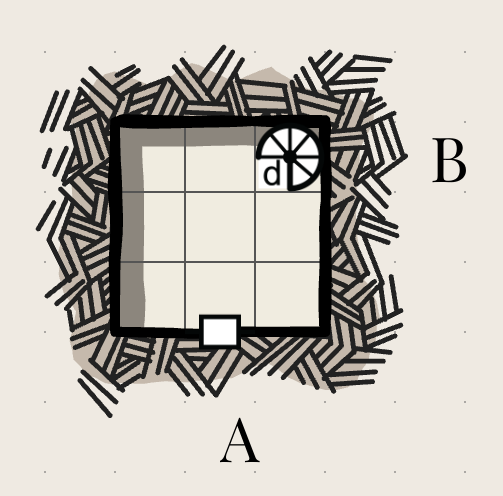
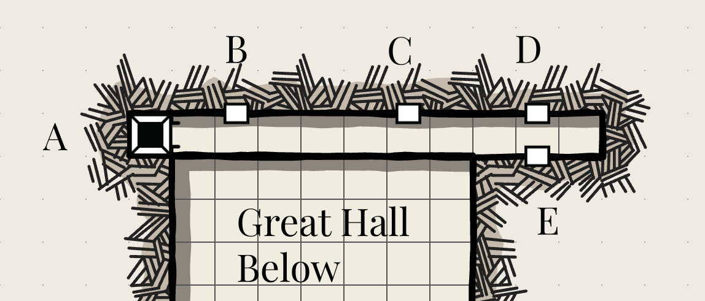
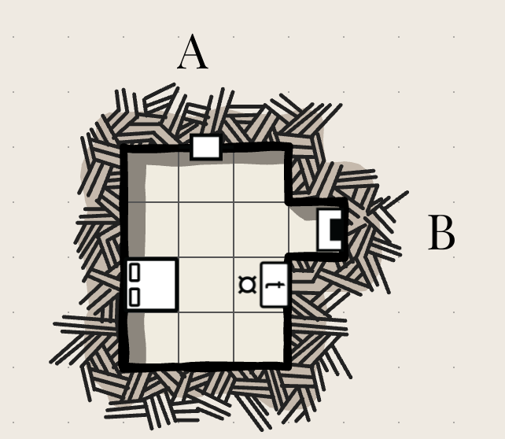
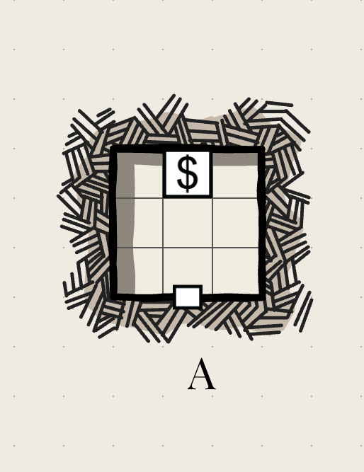
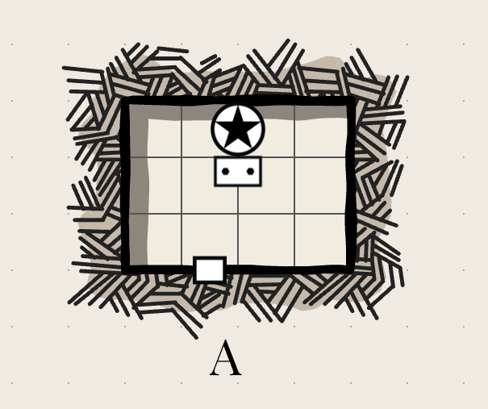

# Second Floor
All rooms here are completely dark. The air is cool, like a cellar.  

## Landing 

This 15' by 15' room is covered in heaps of moldy fabric, and has several stools. A pile of dirt has fallen through what was once a large window, but you can squeeze past it to reach the door to the west (A). There are also stairs down to the floor below (B)

## Hallway

A section of this hallway is also a balcony overlooking the Great Hall. Arched windows look out over it. There are three doors evenly spaced on the east side (B, C and D), and one on the west side (E), beside what would be the great hall. 

At the far north end is a narrow chute going down (A). 

There is a sleeping pit viper here. It enters and exits this ruin through a hole in the ceiling which is 1' across at its narrowest point. 
3 HP, 12 DEX, bite (d4)
Does not rely on vision, senses its victims by their body heat.
Critical damage: the poison kills the target in 2d4 rounds if not treated.

## Bedroom 

This 15' by 20' room was once a grand bedroom, and has a fireplace on one side (B). It has only one entrance (A). Some dirt has come in the south-facing windows onto a desk, which you could clear away and search given enough time (two segments of the torch clock).

The bed is musty but in surprisingly good shape, and if you wedged the door shut and blocked off the fireplace you could get a good night's sleep.

### Searching the bedroom
If you search the room (which takes one tick on the torch clock) you will find a key, which opens both the treasury and the chapel, and 20 gp in various coins, dated about 200 years in the past, in an elegant and mostly intact coin bag with the emblem of a deer on top.

## Treasury

This door is locked.

There is a 15' by 15' room inside here, and inside is a large and ornate wooden chest of drawers. It displays 10 pieces of large, fine china in a glass case (each piece bulky and fragile, but worth 70 gp intact), each painted in elegant handwriting with exhortations for luck, health, and improbable tales of the family's deeds. Inside a drawer are five large gold torcs, each worth 150 gp. You can carry one without using an inverntory slot, but everyone can see you are wearing something valuable.

There are also a collection of small jars that may have once contained spices, now completely stale.

## Chapel 

This door is locked

The ceiling has crumbled to dust, and a mass of tree roots have broken through. In the middle is a statue of a vaguely humanoid creature with its eyes painted bright red. It has clawed arms holding sheafs of grain and wings with leaves instead of feathers.

An iron circlet, surprisingly free of rust, 

*Relic:* Crown of the harvest priest. 1 charge.

Wearing the crown, sprinkle water over the ground. The plants will grow overnight as though for the past month they have had plentiful water and sunlight according to their needs for the last month, regardless of the actual circumstances. 

Recharge: leave out under the light of the full moon.

> This relic may seem fairly mundane, but having access to such a thing could give you substantial political and social power, if you play your cards right.

> There are similar relics hidden in similar chapels in ruins throughout this region. 

