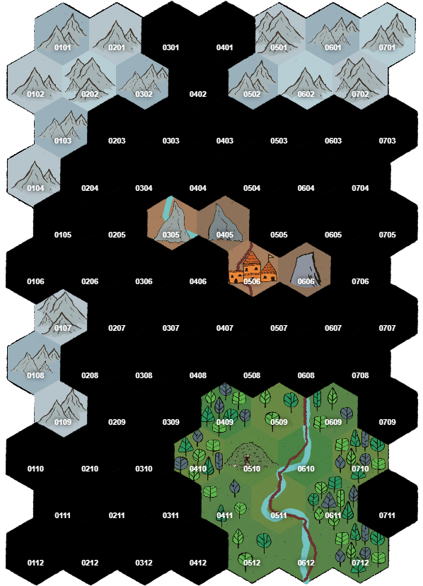

# The Forest

You know that Last Town is to the north, in a mountain pass. You can see the mountains to the north, about 24 miles away, though the mountain range also wraps around to the west. You know from before that the road follows the river going south, through the forest, and probably follows the river north. 

A bit closer, about 16 miles north, you can see a plateau, dry and largely tree-less, marked by three large jagged rocks. In between two of the rocks is perched an ominous looking fort.

## Issues of survival
To determine the time of day, roll a d12. If you've already determined if it's day or night, interpret the number accordingly, otherwise flip a coin to decide if it's AM or PM.

Travel at night will require a light source or need to be done at half speed. You are likely to encounter different types of dangers at night than during the day. In particular, it is known that strange and supernatural creatures are more likely to be afoot at night.

You will need to sleep for 6 hours out of 24 hours to not be deprived. When you first escape, however, you are on your own and if you sleep there will be nobody to keep watch, which is of particular concern if you can't find a safe and hidden location to sleep. You also need to eat to not become deprived. Since during your escape, you are not well supplied, too much caution could be as deadly as too little. It's also possible that you might find solutions to some of these problems as you make your escape north.

If all goes well, you could always return to investigate anything interesting after you've reached Last Town, had a chance to resupply, and found someone willing to make the trip with you.

## Travel by road 

You know that if you travel by road you are likely to run into soldier patrols. You've already run afoul of them. It's about twice as fast to walk along the road as it is through the forest. You can travel 3 miles (1 hex) in 1 hour. You can generally see who is on the road a mile or so off, but they can see you.

The area along the road is kept free of trees, and trees are sparse on the east bank of the river, but the land is rough and rocky and covered with low brush on either side of the road.

> The intention is that the road is something you will want to avoid unless you can come up with a scheme to make it safe for you, or get to the town to resolve your situation.

Random enounters for traveling along the road can be found [here](./soldiers/road_encounters.md). You should roll every time you enter a hex.

If you reach the fort, more details can be found [here](./soldiers/fort.md).

## The hills and the canyon
If you want to climb one of the three rocky central hills, or attempt to swim or take a boat through the canyon between them, see [here](./soldiers/hills_and_canyon.md).

## Travel through the forest

When you start out traveling through the forest, refer [here](./south_frest/forest_encounters) to what you might find.

> I'm eventually going to try and find a better way of doing this.

If you enter hex 3-8, go [here](./south_forest/poachers.md)

If you go north of hexes 2-7, 3-6, 3-5 or 4-4, go [here](./north_forest/north_forest_overview.md)

