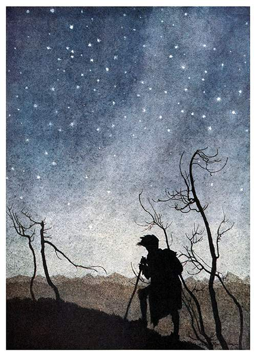

1. [Basics of solo games](solo_basics.md)
2. [Setting](setting.md) 
3. [Character creation](character_creation.md)
4. [First room](first_room.md)
5. Guard post
    - [Store room](guard_post/store_room.md)
    - [Guard house](guard_post/guard_house.md)
6. Dungeon
7. [South Forest](forest/forest.md)
    - [Random Encounters](forest/south_forest/forest_encounters.md)
    - [A not so random encounter](forest/south_forest/poachers.md)
    - [A pervasive danger (and opportunity)](forest/south_forest/bocklins.md)
8. The Road And The Soldiers
    - [Random Road Encounters](forest/soldiers/road_encounters.md)
    - [The Fort](forest/soldiers/fort.md)
    - [The Canyon And Barren Hills](forest/soldiers/hills_and_canyon.md)
9. [North Forest](./forest/north_forest/north_forest_overview.md)
    - [Random Encounters](forest/north_forest/north_forest_encounters.md)
    - [Not so random encounter](forest/north_forest/miners.md)
10. [The Town](./town/overview.md)
    - [Inns and other adventurer-friendly places](./town/adventurers.md)
    - [The government and the military](./town/government.md)
    - [The merchants](./town/merchants.md)

